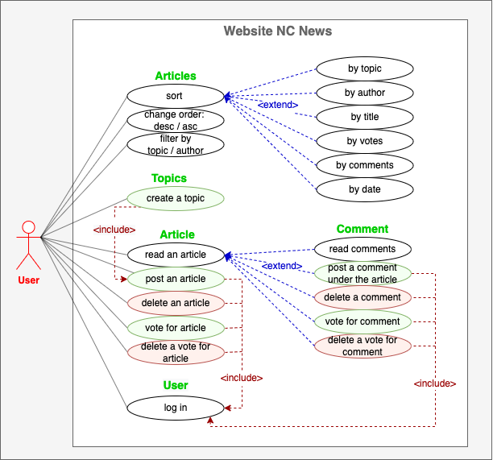
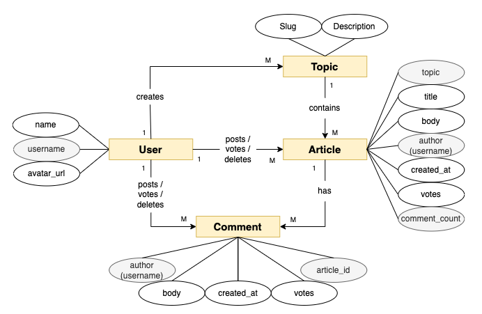

# NorthCoders News

The project was created as a part of studying at **Northcoders Bootcamp** in
July-October 2022.

The website is **hosted** on Heroku.com
https://student-coders-news.herokuapp.com/.

The **prototype** was created on marvelapp.com
https://marvelapp.com/prototype/b69e7dj/screen/88847864

## What is the project?

### const featuresOfProject = {

<!--  -->

    programming_language:   "Javascript",
    runtime_environment:    "Node.js",
    database:               "PostgreSQL",
    web_app_framework:      "Express.js",
    user_interface_library: "React.js"
    programming_style:      "Test Driven Development",

<!--  -->

}

### Use case diagram

demonstrates the different ways that a user might interact with a system

### Entity relationship diagram

is a visual representation of a system’s data

## Instructions

### To clone repository

Read instructions in GitHub docs
https://docs.github.com/en/repositories/creating-and-managing-repositories/cloning-a-repository

### To Install dependencies

### To seed local database

### To run tests

 <!-- npm install pg -->

    <!-- To use node >= 14.x you will need to install pg@8.2.x or later -->

You will need to create two .env files for your project: .env.test and
.env.development. Add PGDATABASE=nc_news_test in .env.test file and
PGDATABASE=nc_news in .env.development file. Double check that these .env files
are .gitignored.

We'll have two databases in this project. One for real looking dev data and
another for simpler test data. Test and development database structures are
exact copies of each other.

A seed function is one that will remove any existing data from a database,
recreate the tables and repopulate it dynamically.
